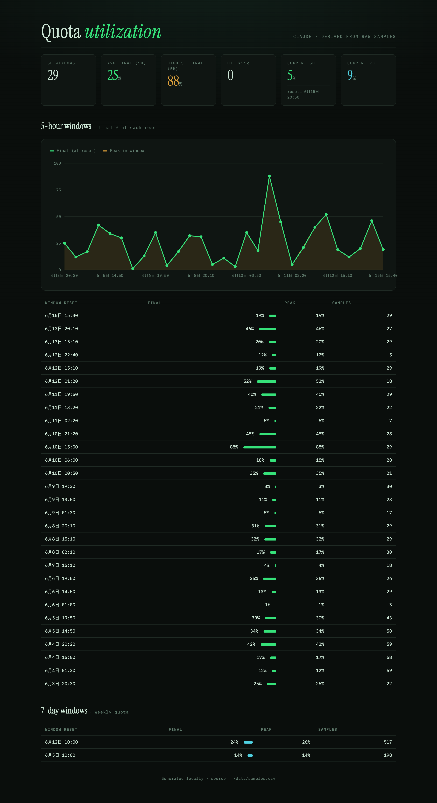

# Claude Quota Logger

*English · [中文](README_ZH.md)*

Records **how much of each rolling 5-hour quota window you had used right before it reset** (the real server-side "utilization %" history) and renders an offline HTML report. The 7-day weekly quota is tracked too.



## Why

Claude subscription rate limits run on rolling 5-hour windows. Once a window resets, the server no longer tells you how much of the *previous* window you ended up using. This project periodically polls Anthropic's internal usage endpoint and **persists each window's utilization** so you can look back at:

- the final utilization at the end of each 5h window (`final`)
- the peak utilization reached during the window (`peak`)
- which windows came close to or hit the cap (≥95%)
- the trend of the 7-day weekly quota

The data source is the undocumented endpoint `GET https://api.anthropic.com/api/oauth/usage`, which may change or break at any time.

## How it works

```
              every 10 min (launchd)
   usage API ──────────────────▶ claude_quota_logger.py ──▶ data/samples.csv  (raw samples, source of truth)
                                                                  │
                                                                  ▼
                                          render_report.py ──▶ data/report.html (windows derived + visualized)
```

- **The logger only appends raw samples**: each poll writes one row to `data/samples.csv` — `(timestamp, 5h reset, 5h utilization, 7d reset, 7d utilization, opus, sonnet)`.
- **Windows are derived from samples**: `render_report.py` groups by `resets_at`; `final` = the last sample in the window, `peak` = the maximum.
- This "store raw samples first, derive later" design is robust: even if a poll happens to miss the exact reset moment (laptop asleep, a skipped run), the window's final/peak can still be reconstructed from the samples already taken — it **does not depend on catching the rollover instant**.

## Layout

Everything lives in the project directory; runtime data goes under `data/`:

```
claude_usage/
├── claude_quota_logger.py                 # sampler: polls the endpoint, appends to data/samples.csv
├── render_report.py                       # renderer: reads samples, derives windows, writes data/report.html
├── com.claude-quota-logger.plist          # macOS LaunchAgent: runs both steps every 10 minutes
├── report_sample.html                     # sample report (for reference)
├── assets/                                # screenshot shown in this README
├── README.md / README_ZH.md               # English / Chinese docs
├── LICENSE
└── data/                                  # runtime data (auto-generated)
    ├── samples.csv                         # raw samples, the source of truth — delete it and history is gone
    ├── report.html                         # generated offline report, just double-click to open
    └── launchd.log                         # LaunchAgent run log
```

> ⚠️ **Do not place the project under `~/Documents`, `~/Desktop`, or `~/Downloads`.** macOS privacy protection (TCC) blocks background processes like launchd from reading those directories, and the scheduled job will fail with `Operation not permitted`. Putting it under `~/AI_workspace/claude_usage` (a non-protected path) works fine.

## Install

Prerequisite: you are signed in to Claude Code on this machine (credentials are stored in the macOS Keychain item `Claude Code-credentials`, and the logger reads the OAuth token from there automatically; the env var `CLAUDE_CODE_OAUTH_TOKEN` and `~/.claude/.credentials.json` are also supported).

```sh
cd ~/AI_workspace/claude_usage
# Replace YOUR_USERNAME in the plist with your macOS user name
# (launchd does not expand ~ or $HOME, so absolute paths are required)
sed -i '' "s/YOUR_USERNAME/$(whoami)/g" com.claude-quota-logger.plist
cp com.claude-quota-logger.plist ~/Library/LaunchAgents/
launchctl load ~/Library/LaunchAgents/com.claude-quota-logger.plist
```

It runs once immediately after loading. The LaunchAgent starts at login and re-fires any polls missed during sleep on wake, so reset moments stay well covered.

> The paths in the plist are written as `/Users/YOUR_USERNAME/AI_workspace/claude_usage` (four places: two in ProgramArguments, two log paths). If you put the project somewhere else, just edit those absolute paths, then re-`cp` + `launchctl load`.
>
> The `EnvironmentVariables` (`HTTP_PROXY`/`HTTPS_PROXY`) block routes the launchd background process through a local proxy — launchd does not inherit your shell's proxy variables. If you can reach the API directly, delete that block; if you use a different proxy port, change it to yours.

## Usage

- **View the report**: open `data/report.html` (self-contained and offline, just double-click).
  > Right after install the "completed windows" count is 0 — that's expected. The first history entry appears once the current 5h window resets.
- **Run once manually**:
  ```sh
  python3 claude_quota_logger.py      # take one sample
  python3 render_report.py --open     # regenerate the report and open it
  ```
- **Continuous foreground polling** (without launchd):
  ```sh
  python3 claude_quota_logger.py --loop
  ```

## Configuration

- **Poll interval**: `POLL_SECONDS` at the top of `claude_quota_logger.py` (default 300s). Lowering it makes the "last reading before reset" closer to the actual reset moment.
- Note: the LaunchAgent's trigger interval is controlled by `StartInterval` in the plist (default 600, i.e. 10 minutes), which is *separate* from `POLL_SECONDS` — in single-run mode the logger takes just one sample, and the real scheduling is done by launchd. After changing the interval, reload the LaunchAgent:
  ```sh
  launchctl unload ~/Library/LaunchAgents/com.claude-quota-logger.plist
  launchctl load   ~/Library/LaunchAgents/com.claude-quota-logger.plist
  ```

## Uninstall

```sh
launchctl unload ~/Library/LaunchAgents/com.claude-quota-logger.plist
rm ~/Library/LaunchAgents/com.claude-quota-logger.plist
# whether to keep the data (data/) is up to you
```

## Maintenance notes

- `data/samples.csv` grows by about 144 rows/day (one every 10 minutes), roughly 50k rows/year — tiny, so cleanup is usually unnecessary. Archive by month if you ever want to trim it.
- The endpoint is an undocumented API. If one day the response structure changes or auth fails, run any Claude Code command first to refresh the login, then check `data/launchd.log` to troubleshoot.
